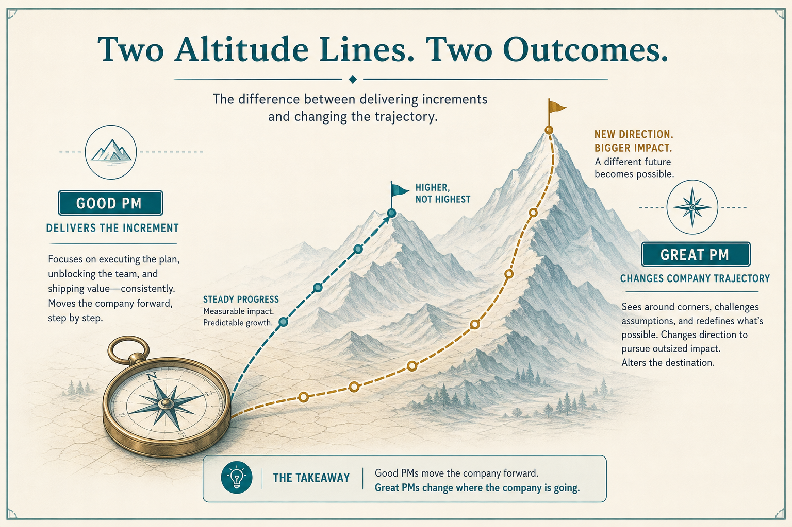

# Good PMs deliver; great PMs change trajectory

**Source:** Shreyas Doshi (@shreyas)
**Post:** https://x.com/shreyas/status/1249039638829793280

## What it claims

Good deliver quality results; great change company trajectory. Metrics-informed not metrics-driven; research informs what to build; facilitate team-owned ideas; ask “What am I getting wrong?”; whole experience (docs/API/support) is the product; iterate PRDs so eng isn’t blocked; adaptive process per team; advocate infra; prevent some problems and ignore others; fix strategy before executing a bad one; team can describe the strategy; legal/security are advisors; principles are editable; these are signposts, not commandments.

## Why it matters for a PO

Default PO is “good” (deliver the increment). Useful bar is trajectory and unblocked teams, without a new commandment deck.

## 3 takeaways

1. Strategy before execution.
2. Make pushback easy; keep docs unblocking.
3. Treat principles and quarterly goals as editable.

## Practice this week

Run one Good→Great shift for five days (e.g. “What am I getting wrong?”).
