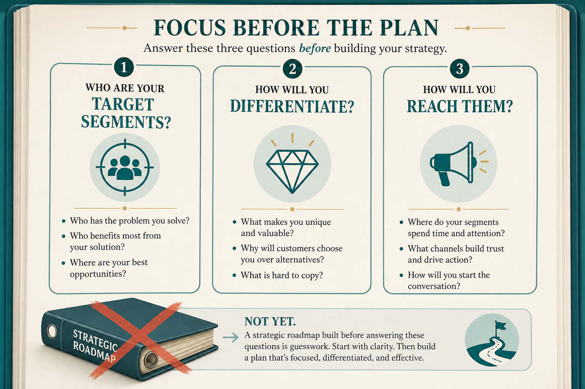

# B2B strategy: three questions, eight tests

**Source:** Shreyas Doshi (@shreyas)
**Post:** https://x.com/shreyas/status/1384008853004578822

## What it claims

Strategy = target segments, differentiation, how you reach them. Tests: Porter generic strategy, visualizable capabilities, Helmer Powers now and new, credible execution, non-obvious insights not rah-rah, not “be the best,” uniqueness (Roger Martin). Amazon 5Qs at feature level. Roadmaps, OKRs, vision, plans are not strategy even with a “Strategic” prefix.

## Why it matters for a PO

Enterprise artifacts wear a strategy badge. The three questions call that out.

## 3 takeaways

1. Segments / differentiation / reach.
2. Specific, visualizable, non-obvious.
3. 5Qs at feature level.

## Practice this week

One-pager: segment, non-target, visualizable differentiation, reach; run tests 1, 6, 7, 8.
