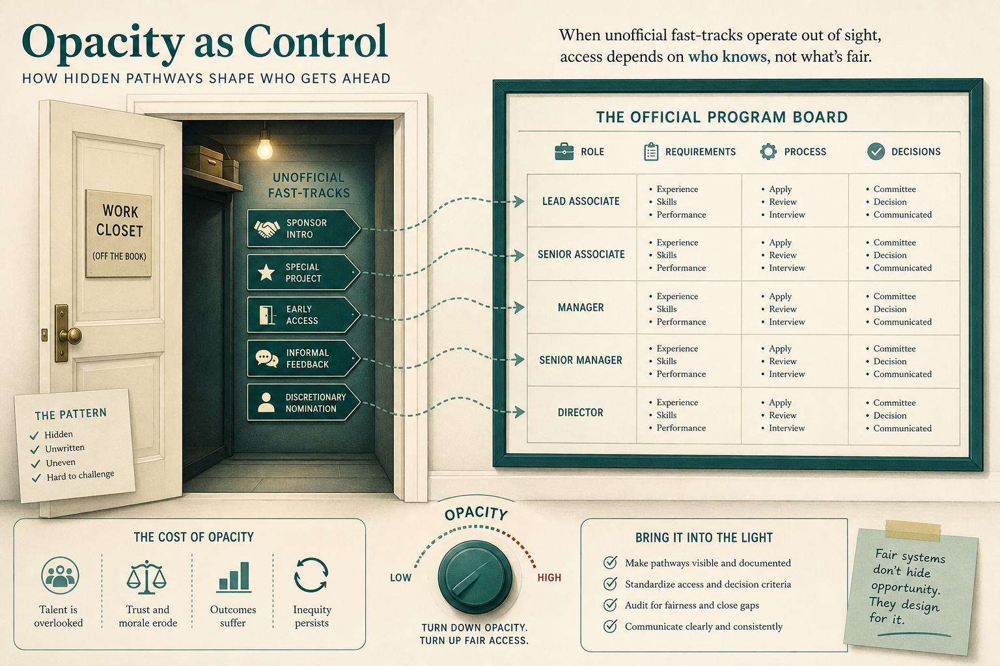

# Visualizing work threatens how power currently works

**Source:** John Cutler (@johncutlefish)
**Post:** https://x.com/johncutlefish/status/1175967762247647233

## What it claims

Program/portfolio visualization is powerful; resistance is the story: opacity as control, fear of micro-management, unofficial fast-tracks, back-alley dependencies, elephants (reactive capacity), no owner of system health, fear of a mandated single process, discomfort of seeing you can’t do it all.

## Why it matters for a PO

A board is not a tooling request; it changes who can hide work.

## 3 takeaways

1. Opacity is a control strategy.
2. Fast-tracks becoming visible is the point.
3. Visualize without imposing one process; name system-health ownership.

## Practice this week

One program view (WIP, reactive vs planned, dependencies). Note which resistance shows up.
