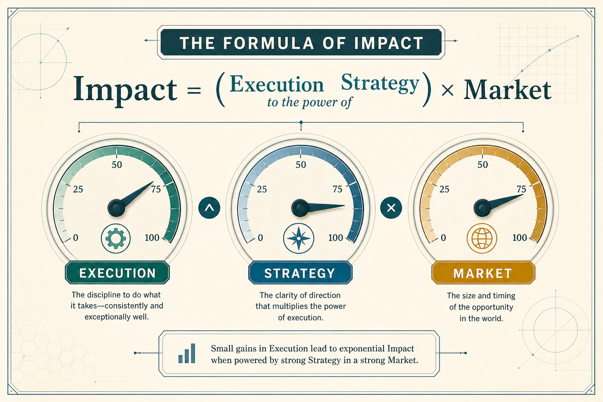

# Impact ≈ (Execution ^ Strategy) × Market; hire execution-strong early

**Source:** Shreyas Doshi (@shreyas)
**Post:** https://x.com/shreyas/status/1429544548628189186

## What it claims

A relative formula: Impact = (Execution ^ Strategy) × Market. Zero execution or zero market kills impact. Zero strategy will not kill you immediately but caps long-term impact. Strategy is the exponent, so excellent strategy with OK execution beats the reverse. When starting a team, hire execution-strong first — early culture is how you execute and is hard to undo. Strategy means choices to differentiate and distribute; execution is pace and quality of delivery.

## Why it matters for a PO

POs are pulled into delivery-as-everything or strategy-as-slides. The formula diagnoses which factor is zeroing impact, and justifies staffing for execution quality on a new squad without pretending strategy is optional.

## 3 takeaways

1. Zero execution or zero market kills impact; zero strategy only caps it — until you leave it unfixed.
2. Excellent strategy with OK execution beats excellent execution with OK strategy, because strategy is the exponent.
3. New-team culture is set by how you execute; hire execution-strong first, then add strategy.

## Practice this week

Score your current initiative 0–5 on Execution, Strategy, and Market. Write one sentence on which factor is closest to zero and one hire/ritual that would raise it.
