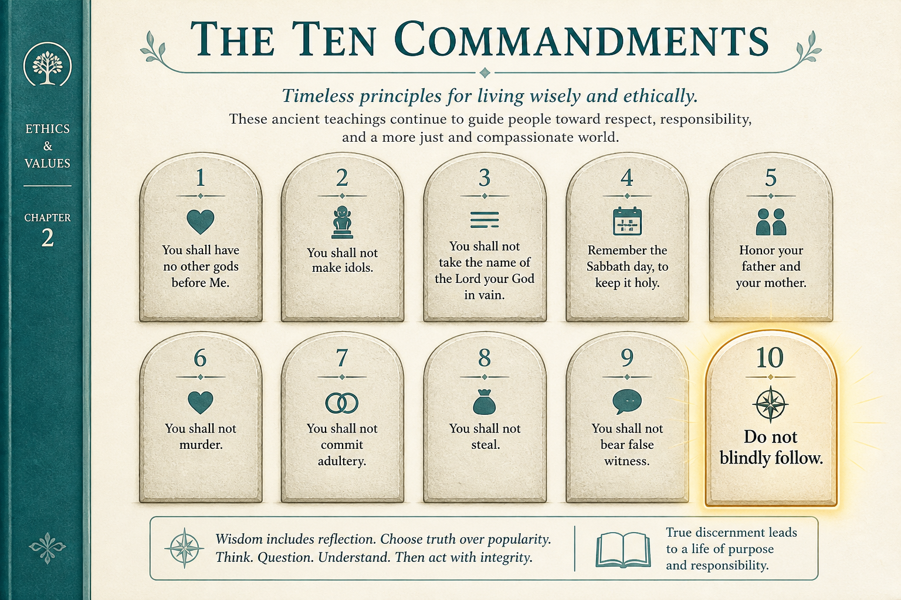

# Ten PM commandments, plus don’t blindly follow them

**Source:** Shreyas Doshi (@shreyas)
**Post:** https://x.com/shreyas/status/1335790461907214337

## What it claims

Ten commandments: focus on The User; optimize for business outcomes not outputs; do not drop the CEO’s name in vain; high agency, deep care, optimism, kind candor, low ego; art and science; understand the real problem and do not confuse Execution with Strategy, Culture, or Interpersonal; user then company then team then self; influence via listening; do not fool yourself; and do not blindly follow any commandments including these — context is paramount.

## Why it matters for a PO

Scrum-PO work is dense with templates. Commandment 10 is the point: use the list as a diagnostic, not a liturgy. Commandment 6 is the weekly trap — treating a strategy or culture issue as an execution fire.

## 3 takeaways

1. Outcomes over outputs; user over CEO-name-dropping.
2. Diagnose problem type before “solving”: execution vs strategy vs culture vs interpersonal.
3. Context beats commandments — including this list.

## Practice this week

Pick one stuck item. Label it Execution / Strategy / Culture / Interpersonal before proposing a fix. If it is not Execution, do not add stories.
