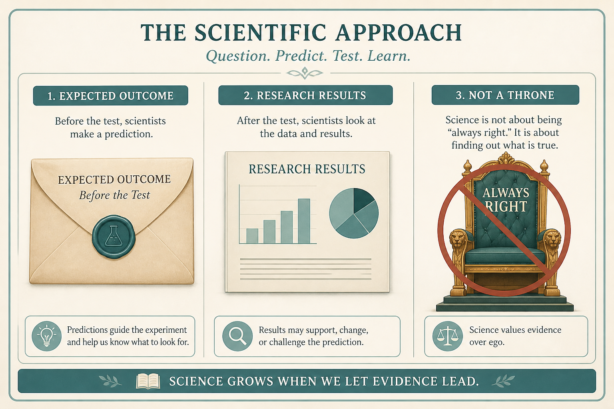

# Sell doing research; UX is a power struggle

**Source:** Pavel A. Samsonov (@PavelASamsonov)
**Post:** https://x.com/PavelASamsonov/status/1549765789565214720

## What it claims

No amount of research will make stakeholders as confident as their biases; sell them on doing research, or they will demand impossible evidence. Ask executives what they expect before testing (Spool), or they will pretend they knew. UX is a power struggle (Cooper): Experts who are Always Right obfuscate how “right” is determined. Sell small, cheap tests aimed at learning; stakeholders must give up being the Knower while remaining on the hook for results.

## Why it matters for a PO

POs often “do a study” after the decision is made, then watch it get dismissed. The work is selling the act of research and locking a prior, not producing a PDF that cannot beat a bias.

## 3 takeaways

1. Sell the decision to research before you sell the findings.
2. Capture expected outcomes in writing before the test, or the result will be absorbed into the existing story.
3. Research that cannot change who decides is theater; the fight is over power, not evidence quality.

## Practice this week

Before the next usability or customer session, send one email: “What do you expect we will see?” Collect answers. Run the session. Compare.
