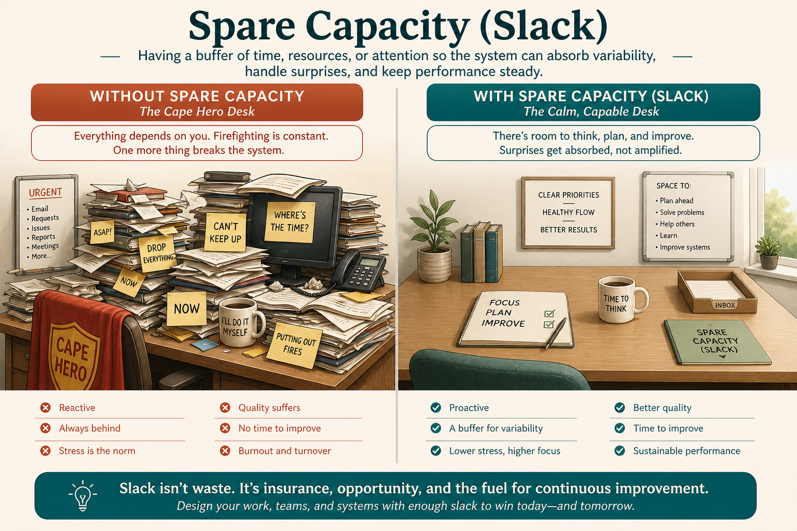

# Hero culture is brittle; spare capacity is resilience

**Source:** Pavel A. Samsonov (@PavelASamsonov)
**Post:** https://x.com/PavelASamsonov/status/1565772214334529540

## What it claims

Hero culture produces wasted work, visibility theater, and single points of failure. “You should be doing a lot” hides that you are doing the wrong things. Critical functions become somebody’s hobby and break when they quit. Heroic baseline is lazy management of goals, effort, and measurement. “People can just step up” is brittle because you have normalized >100% capacity. Spare capacity is resilience: extra work can be asked for temporarily, with reward, by people who opt in.

## Why it matters for a PO

POs often become the hero who “just gets the sprint out.” That hides missing goals and removes the slack you need when a real incident or bet arrives.

## 3 takeaways

1. Heroics as baseline = lazy management of goals, effort, and measurement.
2. Overload hides wrong work; spare capacity is the only real flex.
3. Extra work must be temporary, rewarded, and voluntary — or it is just a new baseline.

## Practice this week

List work you personally absorbed last sprint that is actually a missing system. Pick one item to stop doing unless it is explicitly time-boxed and rewarded.
