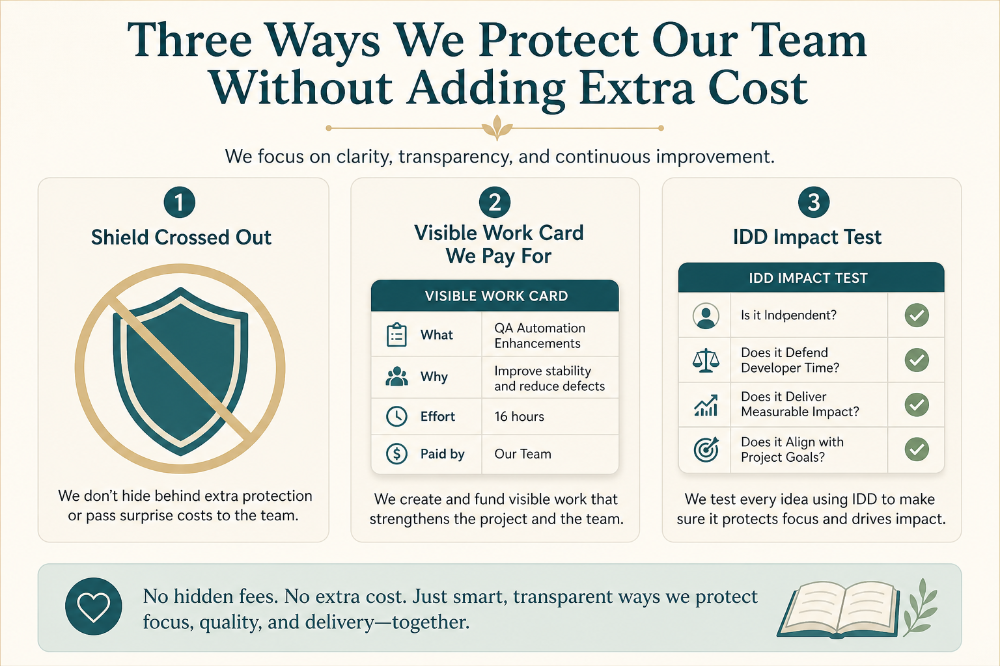

# How PMs earn team trust (don’t shield, do work, IDD)

**Source:** John Cutler (@johncutlefish)
**Post:** https://x.com/johncutlefish/status/1124938723093766144

## What it claims

Don’t hide things to shield the team. Do actual context-building work the team would pay for if they held the budget. Act as a member, not a manager. Own decisions symmetrically. Don’t fake humility. Don’t sugar-coat uncertainty. Don’t disappear empty-handed. Your job is not to keep the team busy. Consider product as IDD — impact driven development — give yourself passing tests in the open. Impact builds trust.

## Why it matters for a PO

Classic PO failure modes are shielding, private stakeholder work, and filling the sprint so nobody is idle. Trust is earned by visible, useful work and impact tests the team can see.

## 3 takeaways

1. Don’t shield; do work the team would pay for if they held the budget.
2. Own decisions symmetrically; don’t disappear; don’t fake humility.
3. Stop feeding busyness; run impact-driven tests in the open.

## Practice this week

In standup, share one thing you know, one thing you don’t, and one impact test for the current increment. Ask whether the team would still “pay” for your last week of work.
