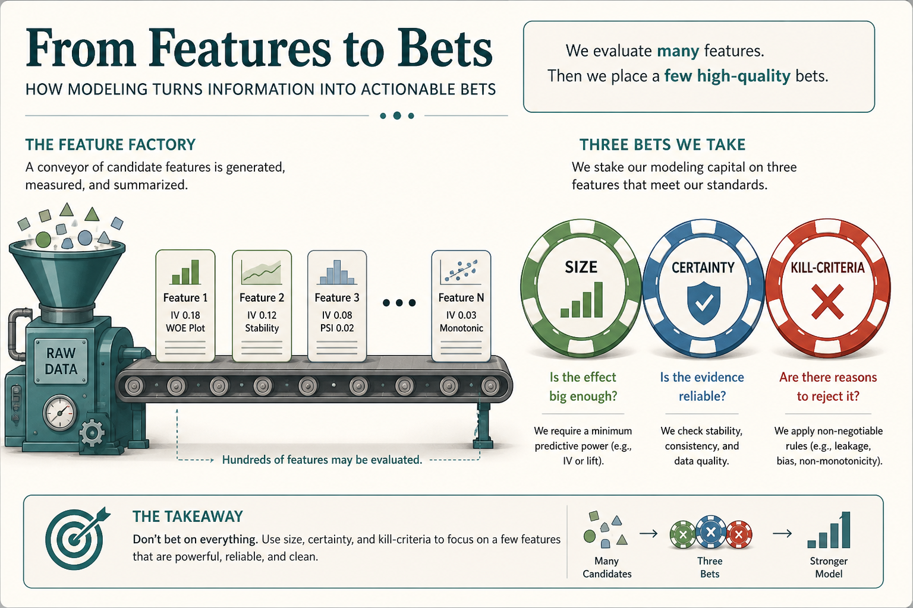

# Feature factories; frame work as bets you can cut short

**Source:** John Cutler (@johncutlefish)
**Post:** https://x.com/johncutlefish/status/1059173660542435328

## What it claims

The issue is a genuine sense of impact. Early on, shipping anything feels like a win; later, low-multiple features are dead-weight. Feature factories are the default for a reason; breaking out is a spectrum. What really matters is transparency and reflection. Framing work as bets feels right: bets can be big, small, certain, a long shot, played well, and cut short. Measurement without the ability to act is more theater. You cannot re-org yourself out of a feature factory.

## Why it matters for a PO

A PO can run a humane feature factory or a theater factory. The durable move is not “ban features”; it is to name bets, allow cut-shorts, and make reflection real.

## 3 takeaways

1. Feature factories are a spectrum, not a slur; transparency and reflection beat purity of process.
2. Frame work as bets that can be cut short, not as commitments that must be completed.
3. Measurement without the ability to act (safety, infra, autonomy) is more theater.

## Practice this week

Relabel three backlog items as bets: size, certainty, and the earliest kill-criteria. Share the kill-criteria with the team before the next sprint starts.
