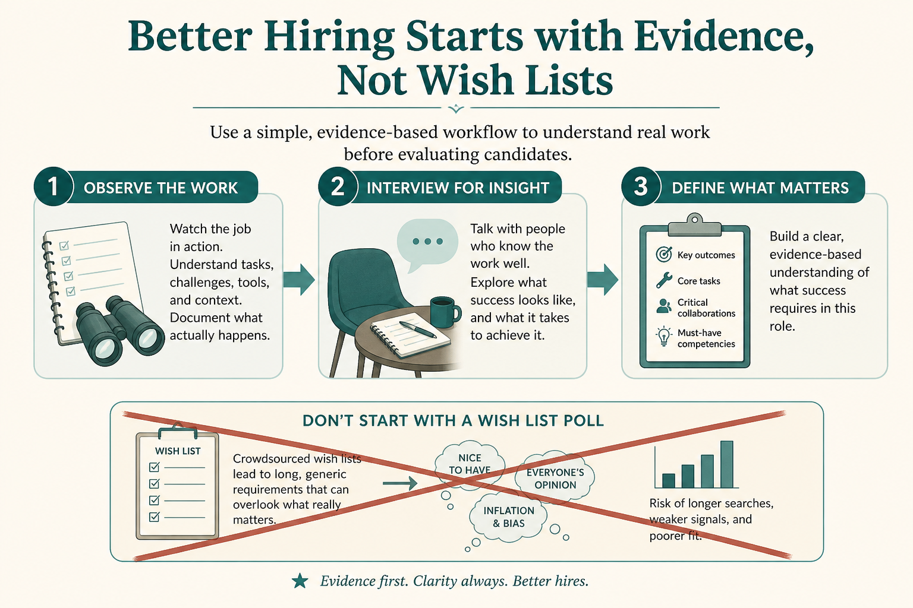

# Research ≠ asking what they want; observe first

**Source:** Pavel A. Samsonov (@PavelASamsonov)
**Post:** https://x.com/PavelASamsonov/status/1083041145159118851

## What it claims

User research is not asking people what they want. It is understanding what people try to do, how they try to do it, and how you can help them reach their goals. Asking is a method, and not always a good one: what people think and what they will say are different. Asking is most helpful after you have observed. Don’t put the burden of defining future state on the user.

## Why it matters for a PO

Stakeholder-driven “just ask the customer” sessions produce a wish list the PO then grooms. Observation-first research gives you jobs, workarounds, and present-state mental models.

## 3 takeaways

1. Research is goals and methods-in-use, not a feature poll.
2. What people say ≠ what they think ≠ what they can design.
3. Observe first; interview second, and never outsource future-state design to the user.

## Practice this week

Shadow or watch one real user session before any “what would you like?” interview. Write three “they tried to…” observations and zero “they asked for…” items.
