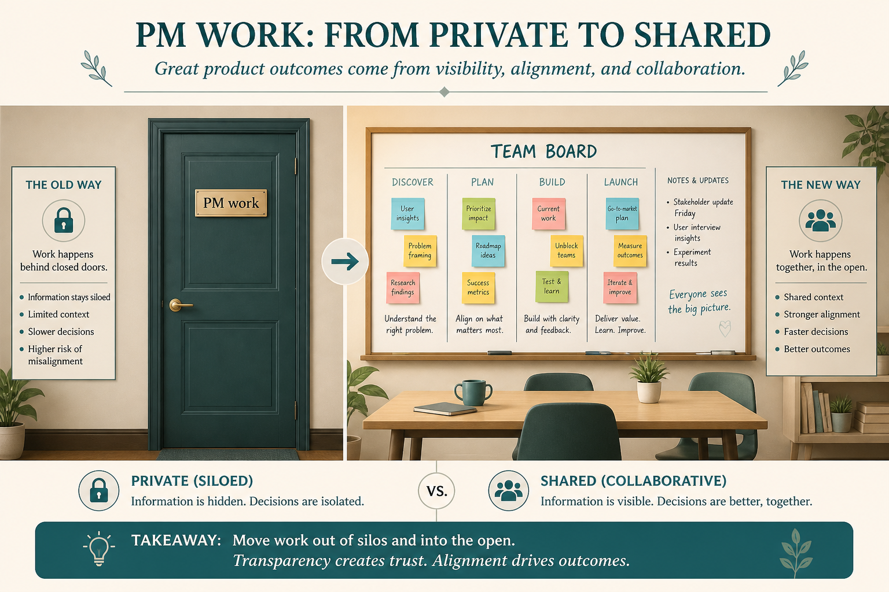

# Eng/design shade at PM because too much PM work is private

**Source:** John Cutler (@johncutlefish)
**Post:** https://x.com/johncutlefish/status/1220240944986877953

## What it claims

Designer–developer trust is rising, so the shade shifts to product. Feature factories aren’t cutting it for professional gratification; standards are going up. As PMs become more empowered, they lose the “the business forced me” excuse. PMs transact much of their work in private away from the team. People default to trust, but it doesn’t take much to start questioning motives. There is a fine line between self-promotion, success theater, and advocacy.

## Why it matters for a PO

As the PO gets “empowered,” the team will no longer accept “the business made me.” Private stakeholder work looks like careerism. Visible advocacy and shared discovery stay on the right side of that line.

## 3 takeaways

1. Designer–eng trust rising raises the bar on product, not lowers it.
2. Empowerment removes the “business forced me” excuse.
3. Private PM work is the fastest way to have motives questioned; do the work in the open.

## Practice this week

Bring one previously private stakeholder conversation into the team space: what was asked, what you pushed back on, what remains undecided.
