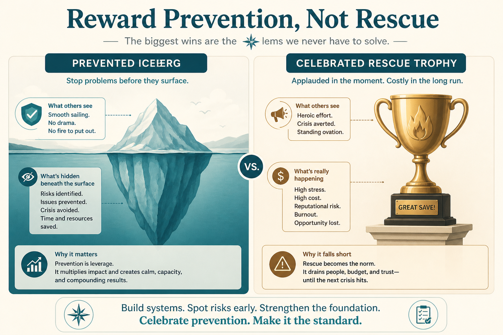

# The preventable problem paradox: orgs reward rescue, not prevention

**Source:** Shreyas Doshi (@shreyas)
**Post:** https://x.com/shreyas/status/1218724150312751104

## What it claims

Smart companies make “what were they thinking?” mistakes because of an organizational bias: the preventable problem paradox. Superman II: Clark tries to prevent a fall and is ignored; Superman rescues and is celebrated. If you are motivated by appreciation, next time you let the boy fall. No org wants to incentivize problem creation over prevention, but they do. Early-career PMs solve the problem of the day; leaders avoid the iceberg. Combat it with awareness, changed recognition, and pre-mortems.

## Why it matters for a PO

Sprint reviews and incident channels celebrate the firefight. Prevention is invisible. If you don’t change what gets praised, you will keep staffing heroes.

## 3 takeaways

1. Heroic rescue is the rewarded story; prevention looks like “nothing happened.”
2. Problem-of-the-day solving is junior-appropriate; leadership is iceberg-avoidance.
3. Combat it with awareness, changed recognition, and pre-mortems — not more heroics.

## Practice this week

Run a 20-minute pre-mortem on one committed increment: “It is six weeks from now and this failed. Why?” Pick one preventable cause to act on before the next rescue.
