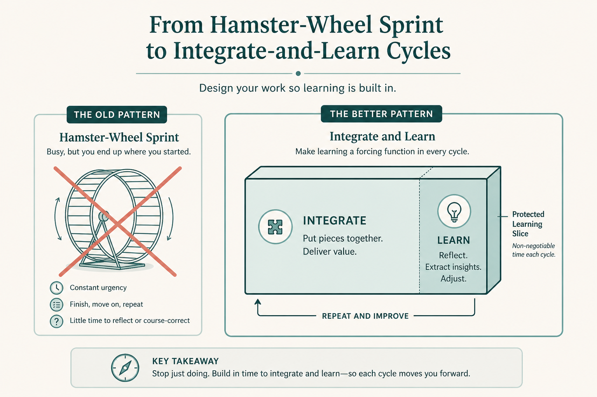

# Hire sprints for learning, not as a delivery hamster wheel

**Source:** John Cutler (@johncutlefish)
**Post:** https://x.com/johncutlefish/status/1119699906384449537

## What it claims

Sprints are a healthy forcing function / enabling constraint — not a hamster wheel or a way to chop a project. A team that “failed” because it missed a story-point goal has misunderstood the job; the sprint was sending a signal. Fold a slice that could potentially be released; great teams choose not to release all the time. Frequent integration of ideas is the point. Once sprints were subsumed under points, owners, burn-downs, and Tetris packing, the original job was lost. Ask: what job are we hiring sprints to do?

## Why it matters for a PO

POs are often scored on points completed. That hires the sprint as a mini-waterfall. Hiring it as a learning forcing function changes what “done” and “failed” mean.

## 3 takeaways

1. A missed point goal can be the sprint doing its job (signal), not a failed team.
2. Fit a slice that could be released; do not treat the sprint as a project-chopper.
3. Name the job you hired sprints to do; if it is only delivery, you have Tetris.

## Practice this week

In the next planning, replace “what will we complete?” with “what will we integrate and learn?” Write one potential-release slice and one explicit non-release learning slice.
