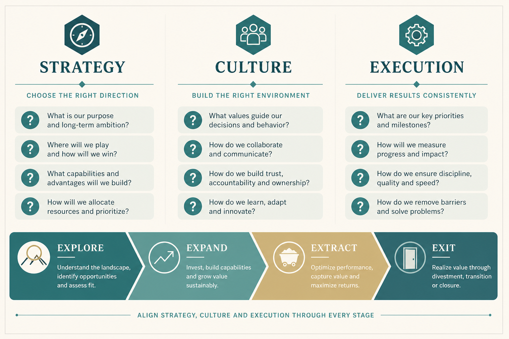

# Answer the Strategy / Culture / Execution questions you already know matter

**Source:** Shreyas Doshi (@shreyas)
**Post:** https://x.com/shreyas/status/1329836053440516097

## What it claims

Questions you know matter but have not answered lately. Strategy: Explore/Expand/Extract/Exit stage; priority segments; Cost vs Differentiation vs Segment; unique advantages. Culture: High Agency; kind candor and creativity; rigor of product decisions; who we are appeasing. Execution: is it really Execution or Strategy/Culture; how often we blame lack of resources; near-term objectives; ability to say No.

## Why it matters for a PO

Quarterly planning often starts with capacity and a feature list. These twelve questions force a diagnosis before the backlog is loaded.

## 3 takeaways

1. Name the product stage (Explore / Expand / Extract / Exit) before debating features.
2. Ask whether the fire is Execution or actually Strategy/Culture — and how often “lack of resources” is the story.
3. Ability to say No, High Agency, and “who are we appeasing” are culture questions with execution consequences.

## Practice this week

With the trio, answer all twelve questions in writing (one sentence each). Star the three you cannot answer honestly. Put those three on the next refinement agenda before adding scope.
