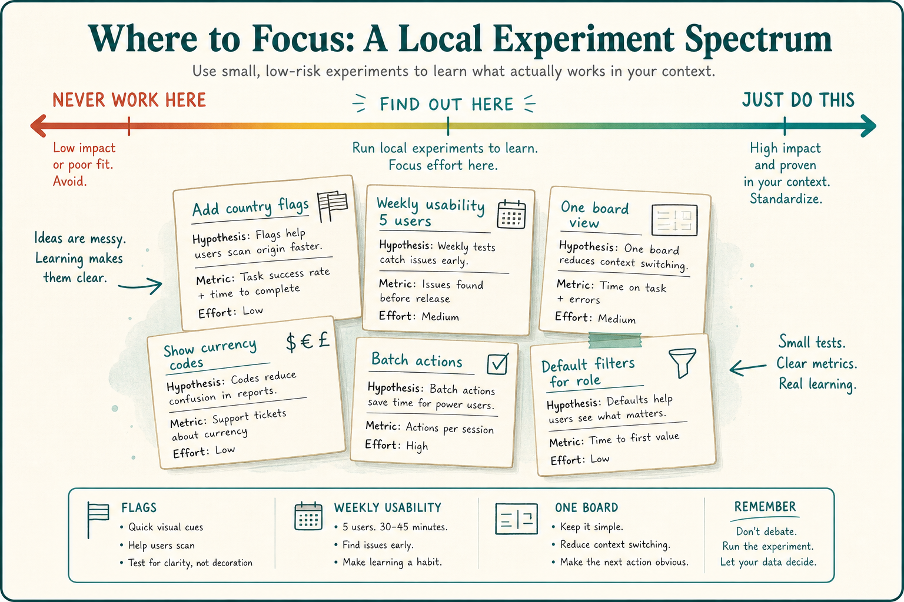

# Real-world continuous improvement is messy local experiments

**Source:** John Cutler (@johncutlefish)
**Post:** https://x.com/johncutlefish/status/1219007478991486977

## What it claims

Real-world CI is a string of local experiments, not a playbook: flags after a CI/CD fight, lightweight instrumentation governance, weekly usability that stuck, a messy pivot/proceed, one board for tech and customer work, a FAQ that beat fancy modals, a Data School that pivoted to advocates, a 30% discovery split that hit a multi-tasking wall. Sit between “that will NEVER work here” and “JUST DO THIS.”

## Why it matters for a PO

Transformation decks sell “JUST DO THIS.” The PO’s job is to run small, time-boxed local experiments and treat messy learning as a step forward, not a failed rollout.

## 3 takeaways

1. Improvement is a string of local experiments, not a copied operating model.
2. Messy pivot/proceed, one-board prioritization, and a FAQ that beats a modal are valid wins.
3. Sit between “never work here” and “JUST DO THIS”; copy-paste without context is the other failure mode.

## Practice this week

Pick one friction (instrumentation, usability, onboarding, or one-board vs two). Time-box a 2–4 week experiment with a keep/kill/pivot criterion. Write the learning even if it is messy.
