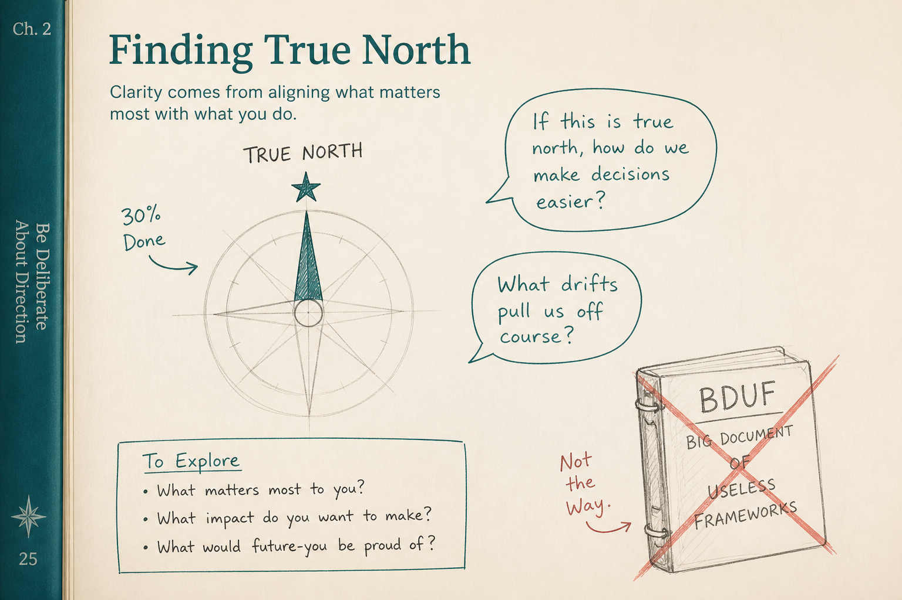

# North-star artifacts are conversation catalysts; leave them ~30% done

**Source:** Pavel A. Samsonov (@PavelASamsonov)
**Post:** https://x.com/PavelASamsonov/status/1125874039841599490

## What it claims

North-star artifacts are ambitious and will never ship as-is. They catalyze conversations. The worst thing you can do is agree to implement them — that is BDUF. Leave them ~30% done and ask for 30%-done feedback. Approach implementers with something clearly not done that already has preliminary desirability. Without a vision, you hill-climb a local maximum. Unused north stars in a portfolio are empty calories.

## Why it matters for a PO

POs are asked to “show the end state” and then commit it as the PI plan. Leaving the vision ~30% done keeps it as a conversation catalyst instead of a fake-committed epic.

## 3 takeaways

1. North star ≠ sprint backlog; agreeing to implement the vision as-is is BDUF.
2. Leave vision artifacts ~30% done and request 30%-done feedback.
3. No vision → local maximum; no conversations or no increments → empty calories.

## Practice this week

Take one north-star slide or mock. Strip it to ~30% fidelity. Run a 30-minute conversation with eng + design: desirable? then doable? then one increment that tests a hypothesis about the star — not a plan to build the star.
