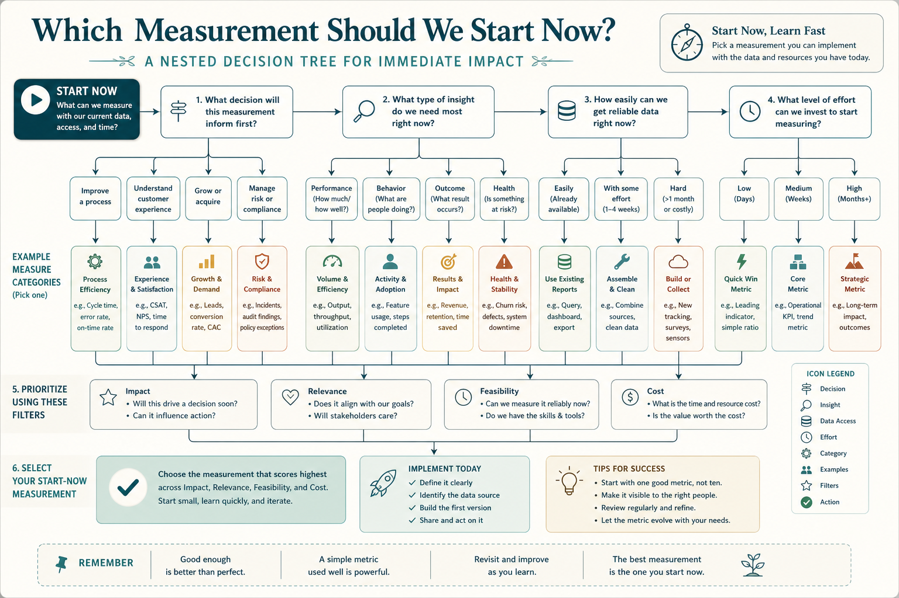

# Measurement is not a maturity stage; start under uncertainty

**Source:** John Cutler (@johncutlefish)
**Post:** https://x.com/johncutlefish/status/1103023335078748160

## What it claims

Asked “at what stage is measurement important?” Cutler: anytime you make decisions under uncertainty. Nested decisions (10–15 major × medium × small) consume thousands of hours. A 10% quality lift, an 8-week effort cut to 4, or 9/15 instead of 5/15 is huge. It is not a stage you get to. Even using data only to run better retros still pays. Start.

## Why it matters for a PO

“We’ll instrument after the MVP” treats measurement as later maturity. Under uncertainty the PO is already making nested decisions; even crude trustworthy data that lets you stop at week 4 is the job.

## 3 takeaways

1. Measurement belongs wherever decisions are made under uncertainty — which is now.
2. Nested decisions compound; a 10% quality lift or an 8w→4w kill is huge.
3. Using data only to run better retros on past calls still pays; start.

## Practice this week

List the next 3 major decisions. For each, write the one number that would change the call, whether you can see it today, and the cheapest way to make it trustworthy before the call — not after the release.
