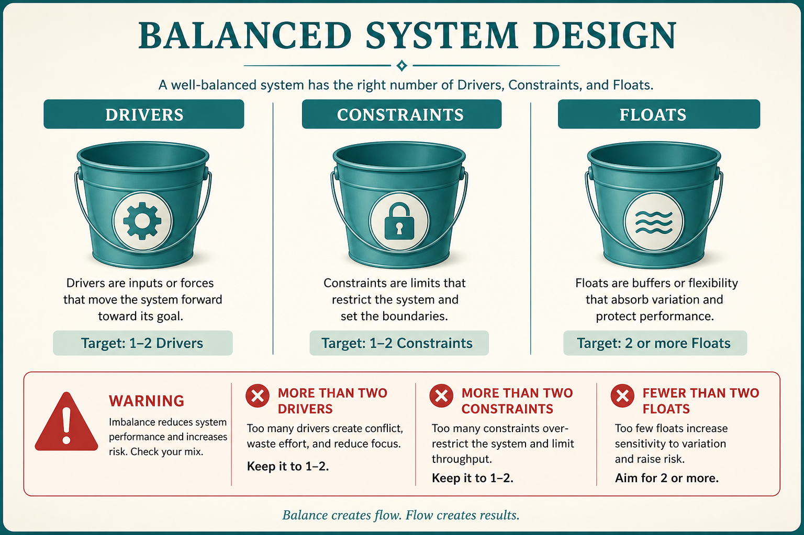

# Minimize drivers and constraints; increase floats

**Source:** John Cutler (@johncutlefish)
**Post:** https://x.com/johncutlefish/status/1218228445869568000

## What it claims

Johanna Rothman: initiatives have Drivers, Constraints, and Floats. Minimize drivers and constraints; increase floats. More than 2 drivers, more than 2 constraints, fewer than 2 floats is almost guaranteed to fail. Catch yourself threading the needle and playing 3D chess. The driver needs to be almost comically focused.

## Why it matters for a PO

Backlogs and PI objectives accumulate personas, dates, platforms, and “must also.” The PO can name a driver as a driver and kill a constraint or add a float before the initiative is guaranteed to fail.

## 3 takeaways

1. Count drivers, constraints, and floats on every initiative; >2 / >2 / <2 almost fails.
2. “Thread the needle” and “3D chess” are the warning lights.
3. Make the driver almost comically focused; add floats on purpose.

## Practice this week

For the current committed increment, list every driver, constraint, and float on one page. Cut to ≤2 drivers and ≤2 constraints; name ≥2 floats the team is actually free to move. Share it in planning.
