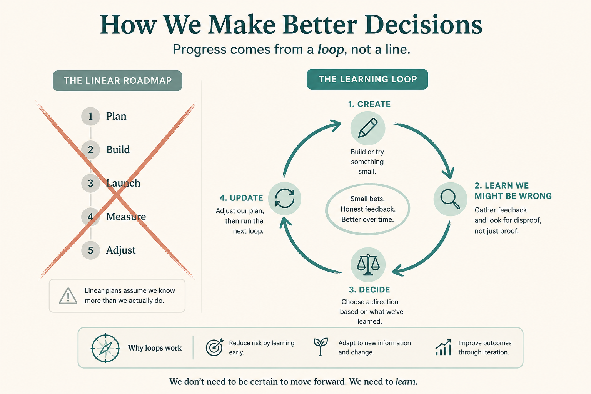

# Iteration without “we might be wrong” becomes a linear roadmap

**Source:** Pavel A. Samsonov (@PavelASamsonov)
**Post:** https://x.com/PavelASamsonov/status/1610705142239600646

## What it claims

Our conceptions of iteration lack any recognition of getting it wrong. The value is not “we made a sketch” but “we made a dozen sketches and learned what not to draw.” Without that, we get linear roadmaps and validation framed to prove we were right. A true iterative process needs time to create, learn, decide, and update. Velocity conversations only ever revolve around creating the artifact.

## Why it matters for a PO

Story-point velocity counts artifact creation. If the roadmap has no time to be wrong, discovery becomes a ritual to confirm the plan.

## 3 takeaways

1. Iteration’s value is learning what not to do, not producing a sketch.
2. If you cannot be wrong, you get linear roadmaps and validation-to-prove-we-were-right.
3. Velocity that only counts “create the artifact” is not an iterative process.

## Practice this week

On the next increment, write the sentence “We might be wrong about ___.” Block time after the first artifact for learn / decide / update. If that time does not exist on the board, the roadmap is linear — say so.
