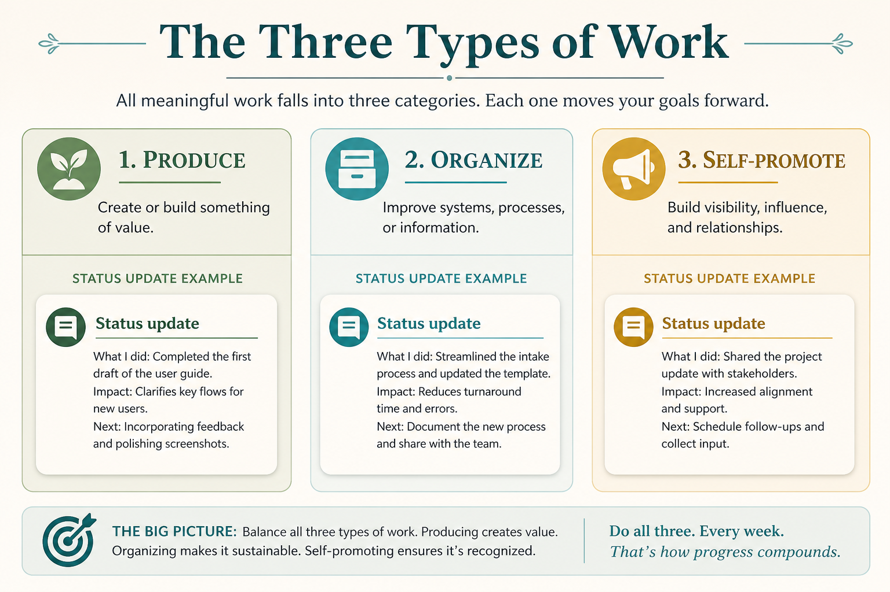

# Diagnose conflict as Produce / Organize / Self-promote

**Source:** Shreyas Doshi (@shreyas)
**Post:** https://x.com/shreyas/status/1329330848919810049

## What it claims

Three types of work: Produce (artifacts for external stakeholders), Organize (structures for Produce), Self-promote (a proxy for one’s competence). Status updates appear in all three. Conflict sources: Self-promote disguised as Produce/Organize (Politics); disagreement on Produce priorities (Strategy); too much Organize vs Produce (Execution). Managers must set the allocation; otherwise everyone invents their own. Inspired by Dalio: people do their job and the job of managing impressions.

## Why it matters for a PO

A PO’s week mixes backlog (Produce), ceremonies (Organize), and status theater (Self-promote). Naming the mix diagnoses politics vs strategy vs execution instead of treating every fight as a process problem.

## 3 takeaways

1. Status updates can be Produce, Organize, or Self-promote — name which.
2. Politics = Self-promote disguised as work; strategy conflict = Produce priorities; execution conflict = Organize/Produce imbalance.
3. Managers must set the allocation; otherwise everyone invents their own, and they collide.

## Practice this week

Tag last week’s calendar: Produce / Organize / Self-promote. Share the split with the team. Drop one Self-promote-disguised-as-Organize ritual, or name one Produce-priority disagreement as a strategy problem.
