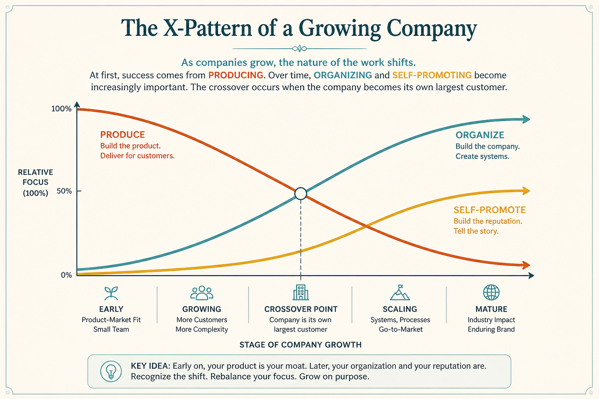

# Watch the crossover: when the company becomes its own largest customer

**Source:** Shreyas Doshi (@shreyas)
**Post:** https://x.com/shreyas/status/1332889514079965186

## What it claims

Crossover is when the company becomes its own largest customer: left of 𝑥 is largely Produce; right of 𝑥 is Organize + Self-promote. Inevitable, but defer it. Startups are almost 100% Produce. Group PMs in large companies commonly spend less than 20% on Produce. Use it to pick roles, discuss where the org is, and track how fast you are moving toward crossover.

## Why it matters for a PO

In a large product org, a PO can spend most of the week on planning trains, status, and internal customers. Naming left-of-𝑥 vs right-of-𝑥 makes the squeeze visible.

## 3 takeaways

1. Crossover = the company is its own largest customer; defer it, don’t deny it.
2. Left-of-𝑥 is Produce; right-of-𝑥 is Organize + Self-promote; Group PMs can drop under 20% Produce.
3. Track movement toward crossover; name your preference when choosing a role or a working agreement.

## Practice this week

Estimate this month’s Produce vs Organize vs Self-promote hours. Mark where you sit on the 𝑥. Agree one protected Produce block the team will not convert into status or process.
