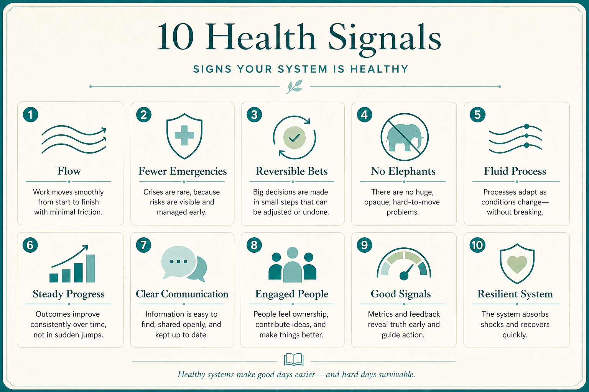

# Ten signals of a healthier product team

**Source:** John Cutler (@johncutlefish)
**Post:** https://x.com/johncutlefish/status/1200260253260009473

## What it claims

Healthier teams show: organic collaboration; flow; fewer emergencies handled calmly; short distance to customers; “let’s give it a try” and reversible decisions; fewer elephants; fluid process that re-forms to the work; stable strategy without silver-bullet whiplash; a single team vs one-person teams; fewer surrounding-org dependencies. Some of the levity is the surrounding org, and how much is immediately controllable he never knows.

## Why it matters for a PO

These are observable team-health signals, not another maturity model. A PO can diagnose emergencies, elephants, mono-process, and individual backlogs instead of adding process when org drag is the limiter.

## 3 takeaways

1. Health looks like flow, reversible bets, and fewer emergencies — not more ceremony.
2. Mono-process and individual backlogs are tells; working agreements should re-form to the work.
3. Strategy whiplash and org drag are not fully inside the squad; name what is.

## Practice this week

Score the squad 0–2 on each of the ten signals. Pick the lowest in-squad item and run one two-week working-agreement change. Name one surrounding-org drag you will not pretend the squad can fix this sprint.
