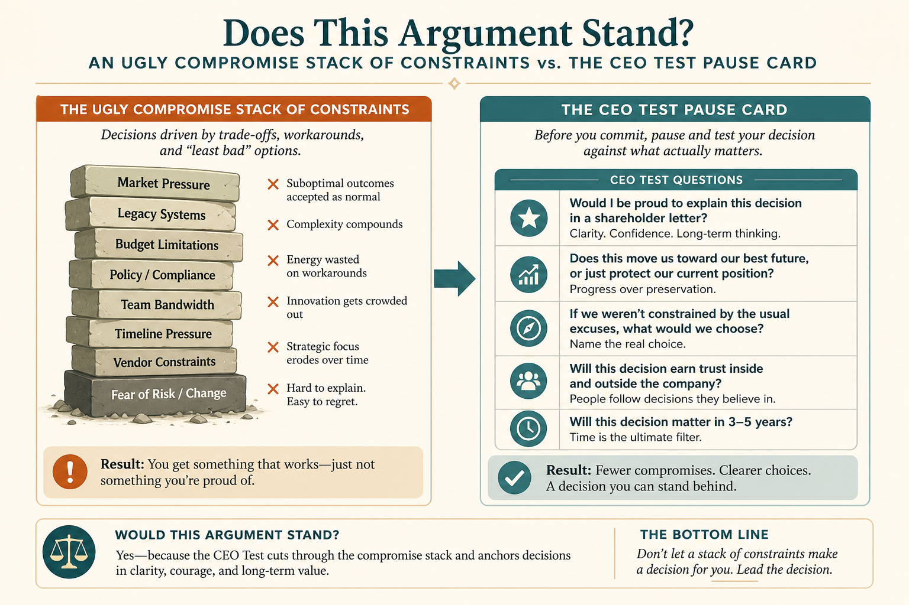

# Apply The CEO Test before you settle on an ugly compromise

**Source:** Shreyas Doshi (@shreyas)
**Post:** https://x.com/shreyas/status/1327518749310676994

## What it claims

Ugly-but-rational compromises (opt-in vs opt-out, frozen headcount) often shatter when a customer-focused exec sees them. The CEO Test: anytime you sense an ugly compromise, imagine making the argument to the CEO. If you bet they would say A, B, C — investigate A, B, C with the constraint owner before locking. Not a name-drop; a shortcut to think bigger. Watch Authority Approval Bias.

## Why it matters for a PO

POs live in constraint stacks. The CEO Test reopens a constraint with the people who own it before the review, instead of discovering in the room that Legal always had a path.

## 3 takeaways

1. Ugly-but-rational compromises often fail the first time a customer-focused exec sees them.
2. Run the imagined CEO dialogue before locking; investigate A, B, C first.
3. The test is to think bigger and hold better compromises — not to name-drop the CEO.

## Practice this week

Take one locked compromise. Write the CEO Test script: our argument, the likely A/B/C pushback, and one investigation with the constraint owner this week before treating it as closed.
