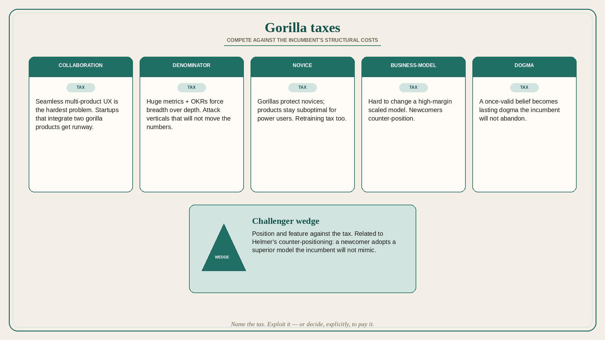

# Gorilla taxes: compete against the incumbent’s structural costs

**Source:** Shreyas Doshi (@shreyas)
**Post:** https://x.com/shreyas/status/1332065861813694465

## What it claims

If you compete with a megacorp — the 800-pound gorilla — understand the tax inherent to being a gorilla, then make that tax work against it with positioning and features. Collaboration tax: getting two product groups to create a seamless end-user experience is “the hardest problem in computer science,” so a startup that integrates two gorilla products typically has runway. Denominator tax: once scale makes the metrics denominator huge, OKRs force breadth of usage over depth — attack high-value verticals that will not move the gorilla’s raw numbers. Novice-user tax (and user-retraining tax) leaves products suboptimal for power users. Business-model tax: hard to change a high-margin scaled model. Dogma tax: a once-valid belief becomes lasting dogma. Other taxes exist (PR, regulatory, infra, bundling). Related to Helmer’s counter-positioning. Name and tame your own taxes inside the gorilla too.

## Why it matters for a PO

In a large industrial software org you often are the gorilla (or sit next to one). Naming Collaboration / Denominator / Novice / Business-Model / Dogma taxes lets the PO stop treating “why can’t we just ship the seamless thing?” as an execution failure and instead position against the tax — or, internally, name the tax so leadership can decide to pay it.

## 3 takeaways

1. Seamless multi-product UX is a collaboration tax, not a missing Jira ticket; startups get runway by integrating what the gorilla will not.
2. Attack (or protect) depth in verticals that will not move the gorilla’s denominator; power-user positioning rides the novice-user tax.
3. Dogma and business-model lock-in are as real as org charts; strategy + speed beats hoping the incumbent “gets its act together.”

## Practice this week

Pick one competitor or one internal sister-product. Write which gorilla tax (collaboration, denominator, novice, business model, dogma) is the real constraint. Propose one positioning or feature that exploits that tax — or one explicit decision to pay the tax internally.
