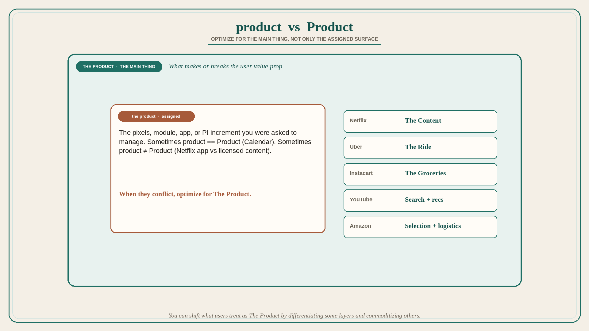

# Optimize for The Product, not only the product you were assigned

**Source:** Shreyas Doshi (@shreyas)
**Post:** https://x.com/shreyas/status/1326795347105116161

## What it claims

Sometimes there is a difference between the product and The Product. The lowercase-p product is the thing you have been assigned to work on; The uppercase-P Product is The Main Thing that makes or breaks the user value prop. Often product == Product (Google Calendar). Sometimes product ≠ Product: if you manage the Netflix app you manage the product, but The Product is the licensed content — the app is a delivery mechanism. When the two conflict, optimize for The Product, not the product. Quiz: Netflix = the Content; Uber = the Ride; Instacart = the Groceries; Amazon = Marketplace/Selection and Logistics increasingly; YouTube = search and recommendation (Creators next). You can at times intentionally modify what the user views as The Product by differentiating on some things and commoditizing others.

## Why it matters for a PO

A PO is usually assigned a module, a surface, or a PI increment. Users buy the whole value prop (the installed base, the data, the workflow, the content). When pixels-on-your-backlog conflict with The Main Thing, the PO’s job is to optimize for The Product.

## 3 takeaways

1. Name The Product for your offering in one phrase before grooming the sprint.
2. Delivery-mechanism work (apps, consoles, portals) is not automatically The Main Thing.
3. You can shift what users treat as The Product by differentiating some layers and commoditizing others.

## Practice this week

Write one sentence: “Our lowercase-p product is X; The Product for the user is Y.” Share with the trio. If X ≠ Y, mark one backlog item this sprint that serves Y even if it does not polish X.
