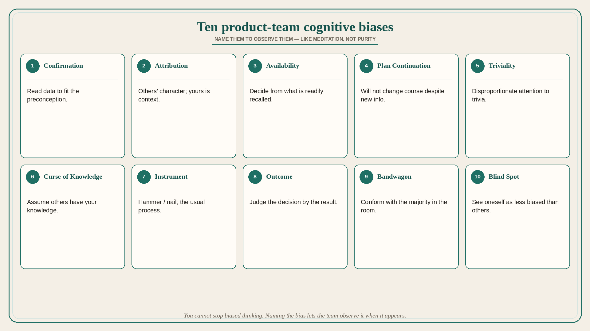

# Ten product-team cognitive biases (name them to observe them)

**Source:** Shreyas Doshi (@shreyas)
**Post:** https://x.com/shreyas/status/1330711544309579777

## What it claims

Add these ten biases to the product team’s shared vocabulary: (1) Confirmation — interpret data to confirm preconceptions; (2) Fundamental Attribution — others’ behavior is character, yours is context; (3) Availability — decide from what is readily recalled; (4) Plan Continuation — unwillingness to change the current plan despite new information; (5) Law of Triviality — disproportionate attention to trivial issues; (6) Curse of Knowledge — assume others have your knowledge; (7) Law of the Instrument — hammer/nail; (8) Outcome Bias — judge decision quality by outcome; (9) Bandwagon — conform with the majority; (10) Bias Blind Spot — seeing oneself as less biased than others. You cannot stop biased thinking; naming biases lets you observe them when they appear (like meditation). Shared vocabulary plus psychological safety: better decisions, better execution, happier teams.

## Why it matters for a PO

PI reviews, experiment readouts, and “the exec talked to one customer” are bias machines. A shared names-list lets the PO interrupt without attacking people.

## 3 takeaways

1. Put the ten names on the wall; the win is observation, not purity.
2. Availability (one customer, one exec anecdote) and plan-continuation (sunk calendar) are the usual PO failure modes.
3. Outcome bias and bias blind spot make “it shipped, so the process was good” and “that other team is biased, we are not” the default story.

## Practice this week

After one refinement or experiment readout, spend five minutes: which of the ten showed up? Name it out loud. Do not debate the person; debate the bias.
