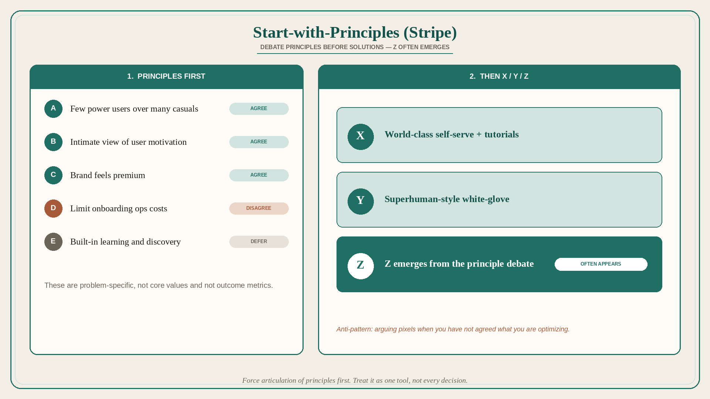

# Start-with-Principles (Stripe): debate principles before solutions

**Source:** Shreyas Doshi (@shreyas)
**Post:** https://x.com/shreyas/status/1322625628433129473

## What it claims

Start-with-Principles is a technique Doshi learned at Stripe. Old approach to “X or Y?”: describe X, describe Y, list pros/cons, decide. New approach: here are N proposed principles — do we agree on them? Discuss; a new option Z often emerges; then decide among X, Y, Z. These principles are not the company’s core values or product philosophy (though informed by them); they are specific to the problem at hand; they are not outcomes. You can start from principles then deduce solutions, or start from proposed solutions and independently conceive principles; the process is cyclic. Treat it as one tool, not every decision. The chief value: force articulation and debate of proposed principles first, so you avoid endlessly debating solution minutiae without recognizing that you disagree on the principles.

## Why it matters for a PO

Most backlog fights (self-serve vs. concierge, polish vs. infra, catalog vs. friction) are disguised principle fights. A PO who puts N proposed principles on the table before X vs. Y shortens the argument and often surfaces a Z.

## 3 takeaways

1. Write proposed principles before the X-vs-Y debate; Z often appears.
2. Principles are context-specific, not core values and not outcome metrics.
3. The anti-pattern is arguing pixels when you have not agreed what you are optimizing.

## Practice this week

Take one live X-vs-Y (onboarding, quality bar, scope). Write 4–6 proposed principles. In a 30-minute trio session, mark agree / disagree / defer. Decide only after the revised list exists.
