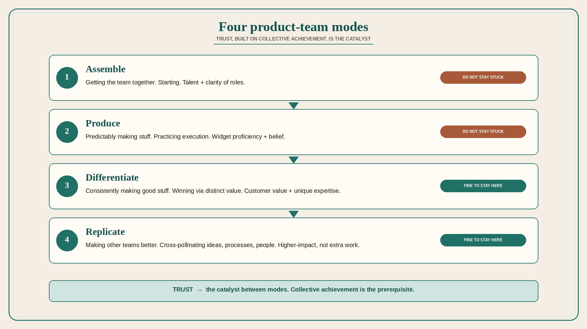

# Four product-team modes: Assemble, Produce, Differentiate, Replicate

**Source:** Shreyas Doshi (@shreyas)
**Post:** https://x.com/shreyas/status/1322070647057510400

## What it claims

Product teams tend to operate in four modes: (1) Assemble — getting the team together; (2) Produce — predictably making stuff; (3) Differentiate — consistently making good stuff; (4) Replicate — making other teams better. Modes may overlap; every team has a primary mode at a given time. It is fine if you are “stuck” in Differentiate or Replicate; it is not fine if you are stuck in Assemble or Produce. Trust is the catalyst for transitioning to a higher-impact mode; collective achievement is a prerequisite. Assemble → Produce: critical mass of talent and clarity of roles. Produce → Differentiate: proficient at making widgets and belief in each others’ abilities. Differentiate → Replicate: good at creating customer value and unique expertise.

## Why it matters for a PO

A new train or a reshuffled trio often lives in Assemble or Produce (standups, velocity, “just ship”). The PO should name the primary mode and the trust-gate to the next one, instead of demanding differentiation from a team that still lacks role clarity.

## 3 takeaways

1. Name the primary mode this quarter; stuck in Assemble/Produce is the failure, not stuck in Differentiate/Replicate.
2. Trust, built on collective achievement, is the transition catalyst — not a new process.
3. Replicate (making other teams better) is a higher-impact mode, not “extra work after the roadmap.”

## Practice this week

With the trio, circle one primary mode. Write the trust evidence required for the next transition (talent+roles / widget proficiency+belief / customer value+unique expertise). Put one action on the next retro that builds that evidence.
