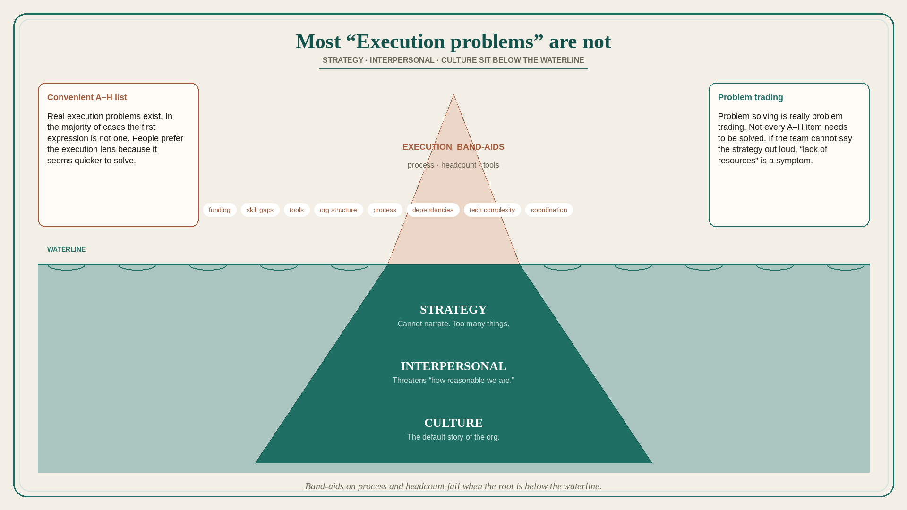

# Most “Execution problems” are Strategy, Interpersonal, or Culture

**Source:** Shreyas Doshi (@shreyas)
**Post:** https://x.com/shreyas/status/1316573473934696449

## What it claims

Most Execution problems are really (1) Strategy problems, or (2) Interpersonal problems, or (3) Culture problems. Good leaders fix the root; bad leaders apply band-aids. Real Execution problems do exist: funding, skill gaps, tools, org structure, process, external dependencies, technical complexity, coordination complexity. In the majority of cases what is initially expressed as Execution is not; it is more convenient to point at those items. People want to believe they are smart and reasonable — so a Strategy root threatens “how smart we are,” and an Interpersonal root threatens “how reasonable we are.” Repeated failure to prioritize is either no sound strategy or a strategy that is not compelling, memorable, and narratable. Apparent lack of resourcing is more often a symptom of missing strategic cohesion. Problem Solving is really Problem Trading; all problems need not be solved.

## Why it matters for a PO

“We need more developers / a better process / fewer dependencies” is the default PI story. The PO’s leverage is diagnosing whether the fire is strategy (cannot narrate, too many things), interpersonal, or culture — and only then treating A–H as the real execution list.

## 3 takeaways

1. Band-aids on process and headcount fail when the root is strategy, interpersonal, or culture.
2. If the team cannot say the strategy out loud, prioritization and “lack of resources” are symptoms.
3. Problem solving is problem trading; not every A–H item needs to be solved.

## Practice this week

Take one “execution” complaint. Classify it as Strategy / Interpersonal / Culture / real Execution (A–H). If Strategy: write the strategy in three narratable sentences and test whether two teammates can repeat it. If it is A–H, pick one actual constraint to trade, not five.
