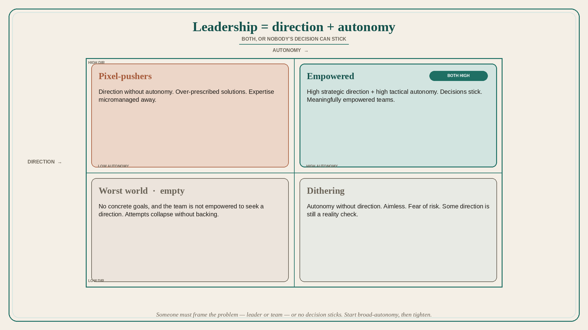

# Leadership is direction plus autonomy (both, or decisions do not stick)

**Source:** Pavel A. Samsonov (@PavelASamsonov)
**Post:** https://x.com/PavelASamsonov/status/1134516731181969410

## What it claims

Leadership provides two things: goals and objectives (direction), and freedom of the team to meet those objectives (autonomy). Those factors determine whether it is possible for anybody to make a decision and have that decision stick. Direction without autonomy turns teams into pixel-pushers. Autonomy without direction is productive only with some direction as a reality check; otherwise it is aimless dithering. A high dose of both is necessary for meaningfully empowered teams. The worst of both worlds: no concrete goals, and the team is not sufficiently empowered to seek a direction — tasks are haphazard and any attempt to change things collapses. Someone needs to frame the problem. Fear of risk keeps teams dithering; most decisions are reversible and should be small. Good leaders start with broad autonomy, then progressively define focus as the problem is understood and trust is built.

## Why it matters for a PO

POs sit in the middle of direction (PI objectives, stakeholders) and autonomy (the trio). Over-prescribing solutions makes pixel-pushers; no objectives plus no cover produces dithering. The job is an environment where a decision can stick.

## 3 takeaways

1. Direction without autonomy = pixel-pushers; autonomy without direction = dithering; both missing = collapse.
2. Someone must frame the problem — leader or team — or no decision sticks.
3. Start broad-autonomy, then tighten focus as knowledge and trust grow; keep experiments small and reversible.

## Practice this week

For one in-flight item, write the objective (direction) in one sentence and the solution-space the team owns (autonomy) in one sentence. If you listed UI details under direction, move them. Share with the trio and ask what would make the next decision stick.
