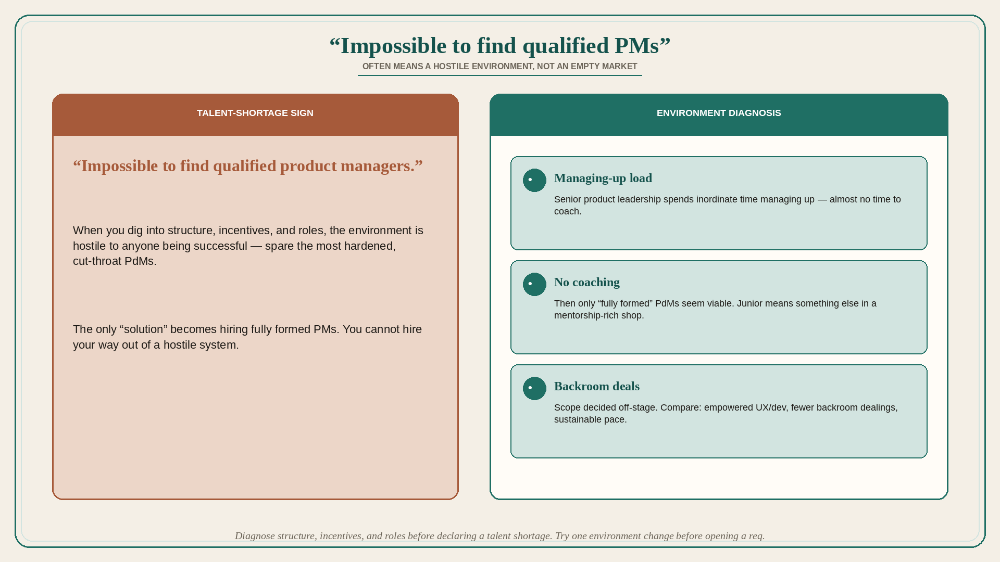

# “Impossible to find qualified PMs” often means a hostile environment

**Source:** John Cutler (@johncutlefish)
**Post:** https://x.com/johncutlefish/status/1200867992990449664

## What it claims

Cutler hears from lots of product leaders that it is “impossible to find qualified product managers.” When he digs into their structure, incentives, roles, etc., he finds environments hostile to anyone being successful — spare the most hardened, cut-throat PdMs. Senior product leadership is spending an inordinate amount of time “managing up,” so much so that they have almost no time to coach and develop their team, so the only solution becomes “fully formed” PdMs. Compare environments where UX and developers are empowered, there are fewer backroom dealings, teams work at a sustainable pace, there is more time for mentorship, and the demands for “junior” PdMs are vastly different. Worlds apart.

## Why it matters for a PO

Talent complaints are often environment complaints. If coaching time is consumed by managing up, the org will only keep cut-throat “fully formed” PMs — and will keep saying the market has no talent. A PO cannot hire their way out of a hostile system.

## 3 takeaways

1. Diagnose structure, incentives, and roles before declaring a talent shortage.
2. Managing-up load on senior product people starves coaching; then only “fully formed” hires seem viable.
3. Empowered UX/dev, fewer backroom deals, sustainable pace, and mentorship change what “junior” even means.

## Practice this week

List three environmental facts (who manages up, who coaches, who makes backroom scope deals). Circle one you can change this month (protected coaching hour, one decision made in the open with UX+dev). Do not open a req until that change is tried.
