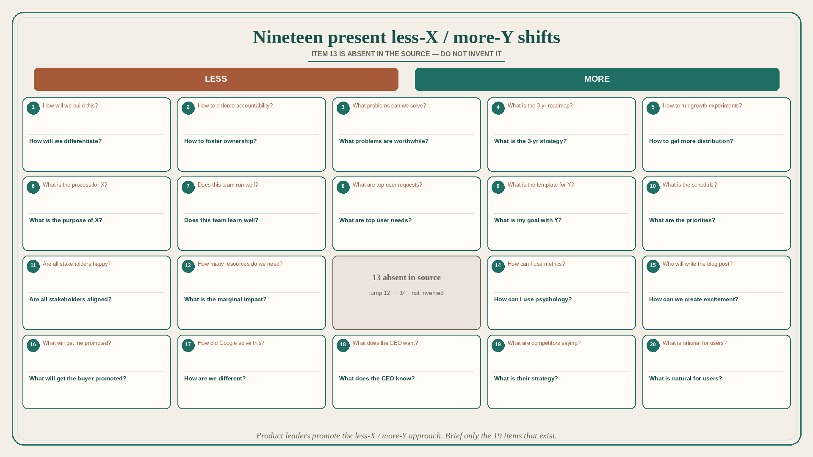

# Nineteen present less-X / more-Y shifts (item 13 absent in source)

**Source:** Shreyas Doshi (@shreyas)
**Post:** https://x.com/shreyas/status/1326199111058481152

## What it claims

What we need in Product Management, as present in the source (item 13 is missing — jump from 12 to 14; not invented): (1) Less “How will we build this?” More “How will we differentiate?” (2) accountability → ownership (3) solvable problems → worthwhile problems (4) 3-yr roadmap → 3-yr strategy (5) growth experiments → distribution (6) process for X → purpose of X (7) run well → learn well (8) top user requests → top user needs (9) template for Y → goal with Y (10) schedule → priorities (11) stakeholders happy → aligned (12) how many resources → marginal impact (14) metrics → psychology (15) who writes the blog post → how we create excitement (16) what will get me promoted → what will get the buyer promoted (17) how Google solved this → how we are different (18) what the CEO wants → what the CEO knows (19) what competitors are saying → what is their strategy (20) what is rational for users → what is natural for users. Product leaders need to promote the less-X / more-Y approach on their teams.

## Why it matters for a PO

These pairs are a diagnostic of feature-factory language. A PO who asks “worthwhile problem / strategy / purpose / needs / aligned / marginal impact / natural for users” runs a different refinement than one who asks “build / process / template / schedule / happy stakeholders / resources.”

## 3 takeaways

1. Brief only the 19 items that exist; do not fill the 13-hole.
2. Roadmap vs. strategy, requests vs. needs, happy vs. aligned, resources vs. marginal impact are the highest-frequency PO swaps.
3. “What does the CEO know?” and “What is natural for users?” beat “What does the CEO want?” and “What is rational for users?”

## Practice this week

Pick three pairs that match this week’s meetings. Rewrite one agenda question from the Less column to the More column. Run the meeting on the rewritten questions.
