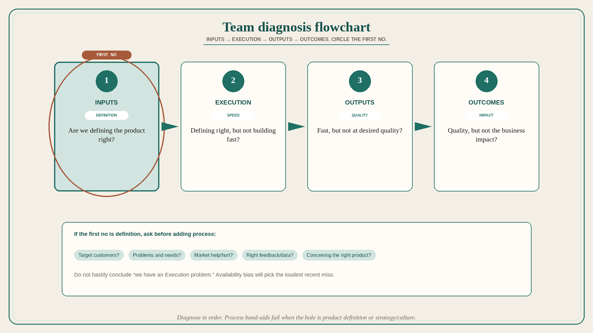

# Team diagnosis: Inputs, Execution, Outputs, then Outcomes

**Source:** Shreyas Doshi (@shreyas)
**Post:** https://x.com/shreyas/status/1349360552603222016

## What it claims

Team diagnosis flowchart: Are we defining the product right? Are we defining right, but not building it fast? Are we defining right, building fast, but not at desired quality? Are we defining right, building fast, at desired quality, but not with the expected business impact? The first question is Inputs; the second Execution; the third Outputs; the last Outcomes. Key bias when diagnosing: Availability Bias. Once you know which question is the biggest problem, break it down further. For “defining the product right”: target customers; problems and needs; how the market helps/hurts; the right type of feedback and data; conceiving the right product. Do this systematically. Do not hastily conclude “we have an Execution problem” and start putting process band-aids on it.

## Why it matters for a PO

Velocity complaints skip the first question. If definition (inputs) is wrong, faster execution produces the wrong outputs with no outcomes. The flowchart forces order: Inputs → Execution → Outputs → Outcomes.

## 3 takeaways

1. Diagnose in order: definition (inputs), speed (execution), quality (outputs), business impact (outcomes).
2. Availability bias will make the loudest recent miss look like “the” problem.
3. Process band-aids on execution fail when the hole is product definition or strategy/culture.

## Practice this week

Walk the four questions with the trio. Circle the first “no.” If it is definition, answer the five sub-questions in writing before adding process or capacity.
