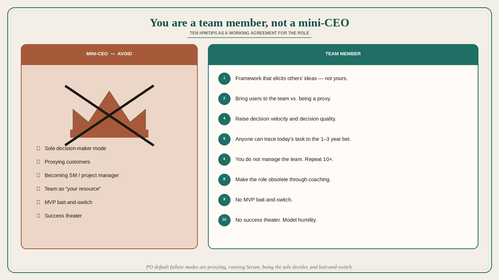

# Ten PM tips: you are a team member, not a mini-CEO

**Source:** John Cutler (@johncutlefish)
**Post:** https://x.com/johncutlefish/status/1168035815538081792

## What it claims

Ten #PMTips: (1) It is not about your ideas — create a framework that elicits and prioritizes the most promising ideas. (2) Bring customers/users to the team vs. being a proxy. (3) Don’t slip into being a scrum master/project manager. (4) Ask how you can improve the team’s decision velocity and decision quality (instead of sole decision-maker mode). (5) Anyone on the team can trace daily tasks through to the 1–3 year bets (without glossing over uncertainty). (6) You do not manage the team; the team is not your “resource”; you are a team member. (7) Become an expert at experiment design and the impact of the team’s work. (8) Work to make your current role obsolete. (9) Don’t do the MVP bait and switch. (10) Try as hard as humanly possible not to slip into success theater; model humility; avoid mini-CEO-ism.

## Why it matters for a PO

PO default failure modes are proxying customers, running Scrum, being the sole decider, treating the trio as resources, and MVP bait-and-switch. These ten lines are a working agreement for the role.

## 3 takeaways

1. Elicit and prioritize others’ ideas; bring users to the team; do not become SM/PM.
2. Improve decision velocity/quality; anyone should trace today’s task to the 1–3 year bet, uncertainty included.
3. Make the role obsolete through coaching; no MVP bait-and-switch; no success theater / mini-CEO.

## Practice this week

Pick tips 2, 4, and 9. Schedule one user in front of the team (not a PO recap). In planning, ask “what would raise decision quality this week?” not “what did I decide.” Strike one MVP promise that the increment cannot keep.
